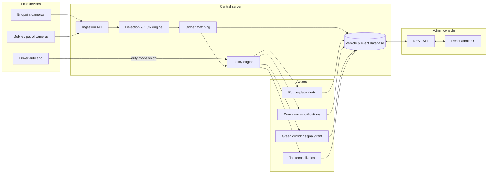
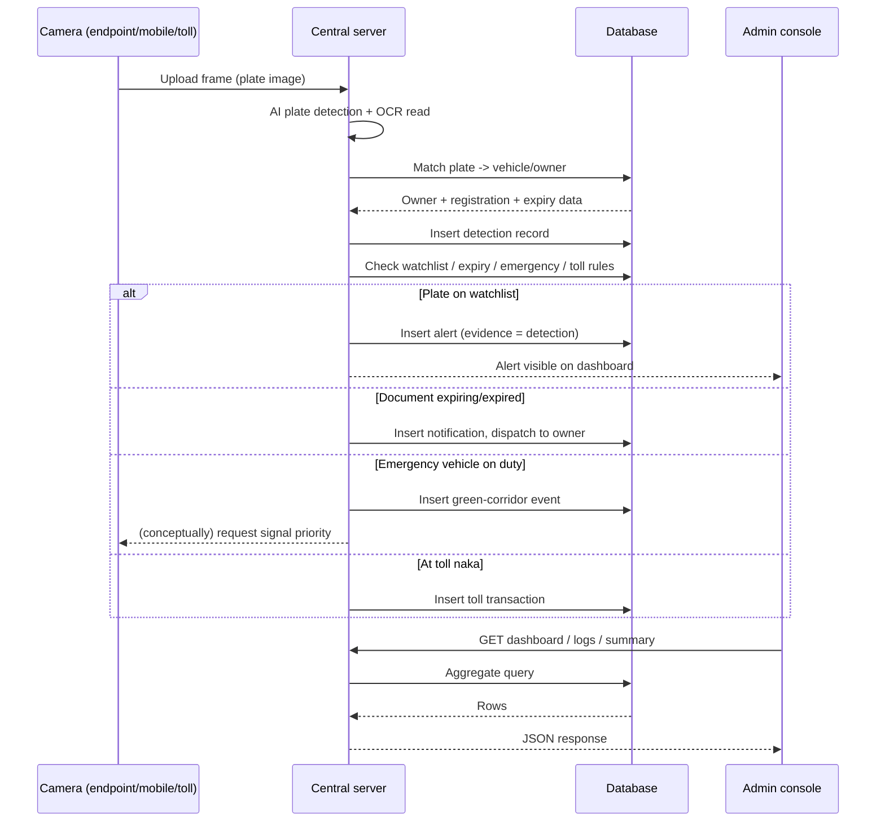
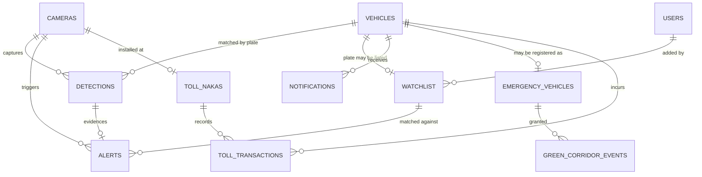
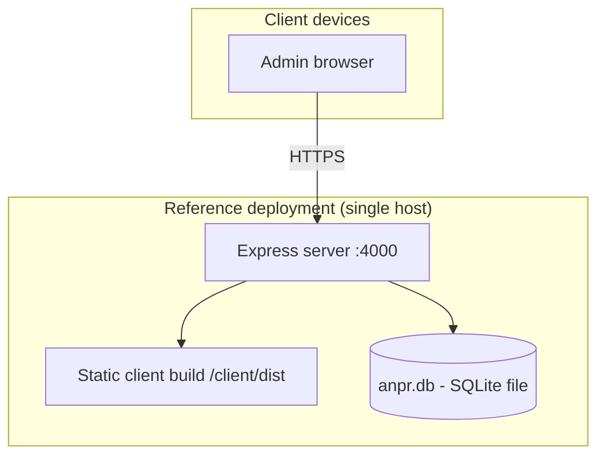
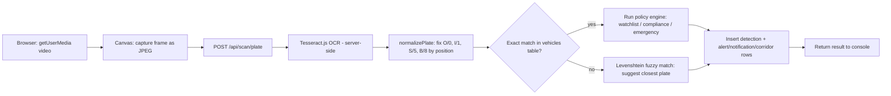

# System Architecture

## AI-Powered Vehicle Number Plate Detection & Alert System (ANPR)

This document describes the architecture of both the conceptual production system
(cameras, AI/OCR pipeline, policy engine) and the reference implementation checked
into this repository (`/server`, `/client`, `/landing`).

---

## 1. Component Overview

**Field devices** stream captured frames to the central server's ingestion API.
The **detection & OCR engine** locates and reads the plate; **owner matching**
resolves it against the vehicle registry; the **policy engine** evaluates the four
modules (rogue watchlist, compliance, green corridor, toll) and emits the
corresponding action. Every step is persisted, and the **admin console** reads and
configures state through a REST API in front of the same database.

In the reference implementation, the admin console's **Live Camera Scan** page
(`/live-scan`) *is* a field device in this diagram: it uses the browser's
`getUserMedia` API to act as a mobile camera, and `POST /api/scan/plate` is the
ingestion endpoint — running real OCR (§8) rather than only reading pre-seeded
detection rows.

---

## 2. Detection-to-Action Sequence

---

## 3. Reference Implementation Stack

| Layer | Choice | Why |
|---|---|---|
| Server runtime | Node.js 22+, Express | Simple, widely deployable HTTP layer |
| Database | SQLite via Node's built-in `node:sqlite` | Zero native build step (no Visual Studio / node-gyp needed), single-file store, ample for a demo dataset of tens of thousands of rows |
| Auth | JWT bearer tokens, bcrypt password hashing | Stateless auth suitable for a console API |
| Admin console | React 18 + React Router, Vite | Fast dev loop, no heavyweight framework needed for a CRUD-style console |
| Landing page | Static HTML/CSS/JS | No build step required to host or share |

This stack is intentionally lightweight for a reference/demo build. §6 below notes
what would change for a production, camera-scale deployment.

### Why `node:sqlite` instead of `better-sqlite3`

`better-sqlite3` requires a native addon compiled with node-gyp, which in turn needs
Visual Studio Build Tools on Windows. To keep the project runnable with only Node.js
installed, the reference server uses Node's built-in `node:sqlite` module
(stable enough for this purpose, no native compilation). A production deployment
targeting concurrent multi-process writes would instead use PostgreSQL — the SQL is
written to be portable to that migration.

---

## 4. Data Model

Entities and relationships (see `server/src/db/schema.sql` for full DDL):

Key tables: `vehicles`, `watchlist`, `cameras`, `toll_nakas`, `detections`,
`alerts`, `notifications`, `emergency_vehicles`, `green_corridor_events`,
`toll_transactions`, `users`.

---

## 5. API Surface

All routes are namespaced under `/api` and (except `/api/auth/login`) require
`Authorization: Bearer <token>`. Role gate shown as the minimum role required.

| Method & path | Role | Purpose |
|---|---|---|
| POST `/api/auth/login` | — | Authenticate, receive JWT |
| GET `/api/auth/me` | Viewer | Current session's user |
| GET `/api/dashboard/stats` | Viewer | Aggregate counts for the dashboard |
| GET `/api/summary/daily` | Viewer | AI-style daily digest |
| GET `/api/vehicles` / `/:plate` | Viewer | Search / lookup vehicle & owner |
| GET `/api/watchlist` | Viewer | List rogue-plate watchlist |
| POST `/api/watchlist` | Operator | Add plate to watchlist |
| PATCH/DELETE `/api/watchlist/:id` | Operator | Activate/deactivate/remove entry |
| GET `/api/alerts` | Viewer | List alerts |
| PATCH `/api/alerts/:id` | Operator | Set alert status |
| GET `/api/cameras` | Viewer | List cameras |
| GET `/api/detections` | Viewer | Search detection log |
| GET `/api/compliance/notifications`, `/stats` | Viewer | Compliance history & stats |
| GET `/api/emergency-vehicles`, `/corridor-events` | Viewer | Fleet & corridor history |
| POST `/api/emergency-vehicles` | Operator | Register emergency vehicle |
| PATCH `/api/emergency-vehicles/:id/duty` | Operator | Toggle duty mode (simulates driver app) |
| GET `/api/toll/nakas`, `/transactions` | Viewer | Toll naka & transaction data |
| GET `/api/logs` | Viewer | Unified searchable event log |
| POST `/api/scan/plate` | Viewer | Live capture: run OCR (or accept a manually confirmed plate), match, and evaluate all policies in one call |
| GET `/api/scan/recent` | Viewer | Recent live-scan detections from this device's virtual camera |
| GET `/api/users` | Admin | List console users |
| POST `/api/users` | Admin | Create console user |
| PATCH `/api/users/:id/role`, DELETE `/api/users/:id` | Admin | Manage roles / remove user |

---

## 6. Deployment View

For the reference implementation, `npm run build` in `/client` produces a static
bundle that the Express server serves directly alongside the API — a single process,
single port deployment suitable for a demo or small pilot.

### Production-scale path (conceptual, not built here)

For a metro-wide camera network, the same logical architecture would typically be
realized as:

- **Ingestion**: a message queue (e.g. Kafka/SQS) in front of the detection workers,
  so camera upload spikes don't block the API.
- **Detection/OCR**: a horizontally-scaled pool of GPU-backed workers running the
  plate-detection and OCR models, decoupled from the request/response path.
- **Database**: PostgreSQL (or a managed equivalent) for concurrent multi-writer
  workloads, with the `detections` table partitioned by time.
- **Policy engine**: a stateless rules service consuming matched-detection events,
  so watchlist/compliance/emergency/toll logic can scale and deploy independently of
  ingestion.
- **Admin console**: unchanged in shape — a React SPA against a REST/GraphQL API —
  but served from a CDN with the API behind a load balancer.

The reference implementation's schema and API shape are deliberately structured so
this migration is additive (swap the database driver and introduce a queue) rather
than a rewrite.

---

## 7. Live Capture / OCR Pipeline

The reference implementation includes a real, working capture path — not only a
viewer over the seeded dataset — so the "Detect & read" step from §2 can actually
be exercised with a phone camera.

Implementation notes:

- **Where OCR runs**: server-side, in `server/src/ocr/worker.js`, using
  **Tesseract.js**. This matches the architecture's intent (§1) that AI/OCR is a
  central-server capability, not something duplicated per field device. It also
  keeps the client bundle free of a multi-megabyte WASM OCR engine.
- **No native build step**: Tesseract.js runs on pure JS/WASM, consistent with the
  choice of `node:sqlite` over `better-sqlite3` (§3) — this project deliberately
  avoids any dependency that needs node-gyp/Visual Studio to install.
- **Plate normalization** (`server/src/ocr/plateNormalizer.js`): OCR frequently
  confuses visually similar characters (`O`/`0`, `I`/`1`, `S`/`5`, `B`/`8`, etc). Since
  an Indian plate has a fixed structure (2 letters + 2 digits + 1-2 letters + 4
  digits), the normalizer corrects each character based on whether its position
  should be a letter or a digit — this alone fixed the `KA05AI2026` → `KAO05AI2026`
  class of misread observed in testing.
- **Fuzzy fallback** (`findClosestPlates`, Levenshtein distance): OCR can also
  insert/drop characters (not just substitute), which the positional corrector can't
  fix. When no exact match exists, the endpoint computes edit distance against every
  registered plate (a few thousand rows — trivial in-memory) and returns close
  matches (distance ≤ 2) as suggestions, so a slightly noisy read still resolves to
  the right vehicle with one tap of confirmation rather than a dead end.
- **Human-in-the-loop confirmation**: the Live Camera Scan page always shows the raw
  OCR text and an editable plate field before/after matching — OCR assists, but the
  operator can always correct a misread before it's treated as authoritative.
- **Unified history**: every scan (matched, unmatched, or manually confirmed) is
  written to the same `detections` table as the seeded data, under a camera named
  `Live Mobile Scanner`, so it's indistinguishable from any other capture source in
  the dashboard, logs, and vehicle detail view.

---

## 8. Security Notes

- Passwords are hashed with bcrypt; JWTs are short-lived (12h) bearer tokens.
- Role checks (`requireRole`) run server-side on every mutating route — the console
  UI hides actions a role can't perform, but the API is the actual enforcement point.
- The reference `.env` ships a development JWT secret; production deployments must
  replace it with a securely generated, non-committed secret.
